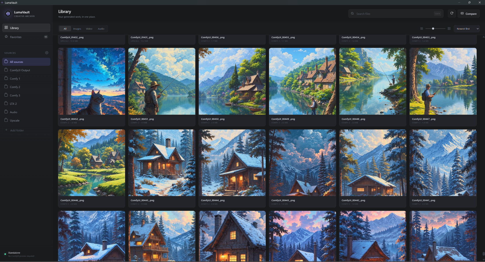
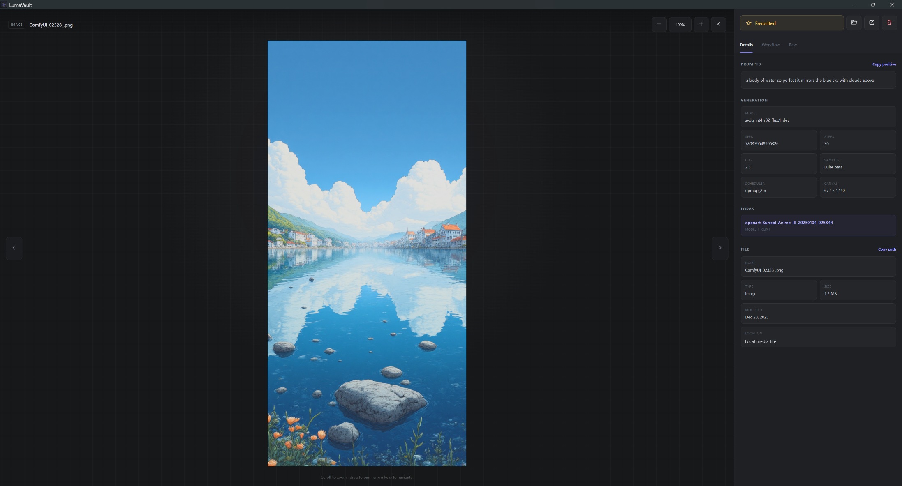

# LumaVault

A polished, standalone Windows media browser for ComfyUI outputs and other creative folders. LumaVault reads files and embedded metadata directly from disk, so **ComfyUI does not need to be running**.

[Download the latest Windows release](https://github.com/Flibens/LumaVault/releases/latest)

## Screenshots

### Library



### Viewer and metadata



## Highlights

- Fast gallery for images, videos, and audio
- Search, sorting, media filters, adjustable thumbnail size, and infinite loading
- Multiple source folders with optional recursive scanning
- Favorites and custom folders shared live with ComfyUI Image Browser
- Image viewer with zoom, pan, keyboard navigation, and correctly contained portrait images
- Video playback with themed custom video controls for play/pause, seeking, volume, mute, and fullscreen; native audio controls remain available
- Detailed ComfyUI metadata: prompts, seed, model, sampler, scheduler, dimensions, and LoRAs
- LoRA Manager/Stacker support that reports only the LoRAs active for an image
- Visual ComfyUI-style workflow viewer with Original/Arrange layouts, collision-safe node dragging, expanded labeled subgraphs and internal links, input/output previews, pan, zoom, fit-to-screen, and selected-node JSON copying
- Separate searchable workflow node list with expandable parameter details
- Selectable metadata and workflow-node text with a themed orange selection highlight
- Raw embedded metadata viewer and one-click copy actions
- Ctrl-click multi-selection with group path-copy and Recycle Bin actions
- A/B image comparison with wipe, difference map, and percentage overlay views
- Explorer reveal, external open, and safe deletion through the Windows Recycle Bin
- Persistent **80%–200% interface scaling** for 4K and high-DPI monitors
- Switchable **Original** and **Acrylic Glass** themes with native Windows wallpaper blur
- Responsive compact layout at large UI scales or narrow window sizes
- Local-only backend bound to `127.0.0.1`

## Windows download

Download `LumaVault-1.1.5-Windows.zip` from the [latest release](https://github.com/Flibens/LumaVault/releases/latest), extract it, and run:

```text
LumaVault\LumaVault.exe
```

No Python installation is required for the packaged release.

## Interface scaling

Open the gear icon beside **Sources**, then adjust **Interface size** from 80% to 200%. Presets are available for 100%, 125%, 150%, and 175%.

The setting scales application text, controls, menus, dialogs, and the metadata inspector. Gallery thumbnail size and media zoom remain independent. The selected size is stored in LumaVault's application state and restored on the next launch.

## Gallery and viewer controls

- **Ctrl-click** cards to toggle multi-selection.
- Left-click a selected card to open group actions.
- **Escape** clears selection or closes the active overlay.
- Click empty viewer space outside the rendered media to close the viewer.
- Use the mouse wheel to zoom images and drag to pan.
- Use the arrow keys to navigate between files.
- Press **F** in the viewer to toggle Favorite.

Recycle Bin actions execute immediately after choosing the menu command. Deleted cards are removed locally, preserving the gallery's scroll position.

## Data and migration

LumaVault stores its settings and thumbnail cache in:

```text
%LOCALAPPDATA%\LumaVault
```

LumaVault and ComfyUI Image Browser share folders and favorites through:

```text
%LOCALAPPDATA%\LumaVault\shared-comfyui-image-browser.json
```

On the first update, LumaVault's saved state seeds this common local file. Afterwards, adding/removing a custom folder or toggling a favorite in either app is available to the other app on its next request or refresh. The shared file contains only folder definitions and favorite IDs; it never stores embedded media metadata, prompts, or workflows.

The legacy ComfyUI Image Browser files remain available as compatibility fallbacks:

```text
C:\Comfy\ComfyUI\user\comfyui-image-browser
```

## Development

Requirements:

- Windows 10 or later
- Python 3.11

```bat
uv venv .venv --python 3.11
set PYTHONPATH=
uv pip install --python .venv\Scripts\python.exe -r requirements.txt
.venv\Scripts\python.exe main.py --browser
```

Run tests:

```bat
set PYTHONPATH=
.venv\Scripts\python.exe -m unittest discover -s tests -v
```

Build the Windows desktop package:

```bat
build.bat
```

## Safety and privacy

LumaVault has no cloud backend. It serves the UI only on localhost and reads the folders you configure. File deletion uses the Windows Recycle Bin through `send2trash` rather than permanently erasing files.
